# Set-up GitHub Pages (static site) for a Repo

## Try it out
GitHub Pages allows you to host a static site (markup and stylesheets) which can be used as an example or a promotional tool for your project. Go to  the link at the top of this repo for an example of how get how pages works (as shown below):
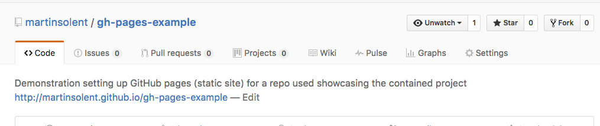

### On GitHub Create new Repo

### Name the Repo
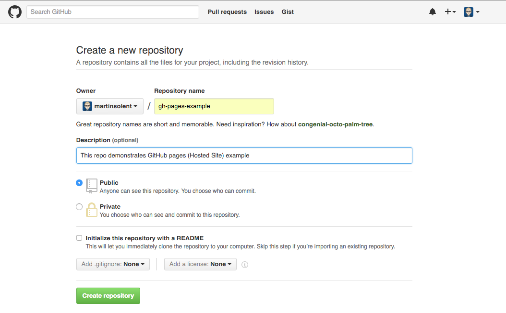

### On GitHub Desktop App Clone Repo you have just create on GitHub
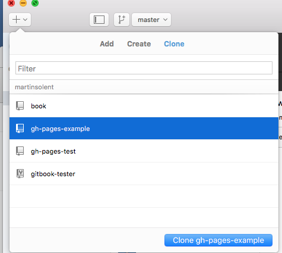

### Select a path to local GitHub folder
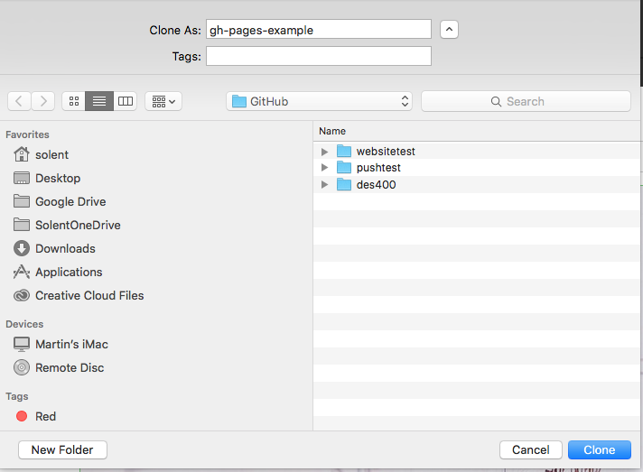

### Copy all site files to this local folder
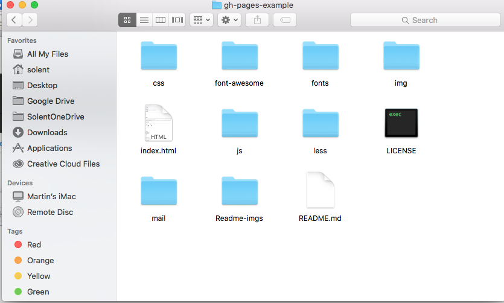

### In GitHub Dektop name and click Commit To Master
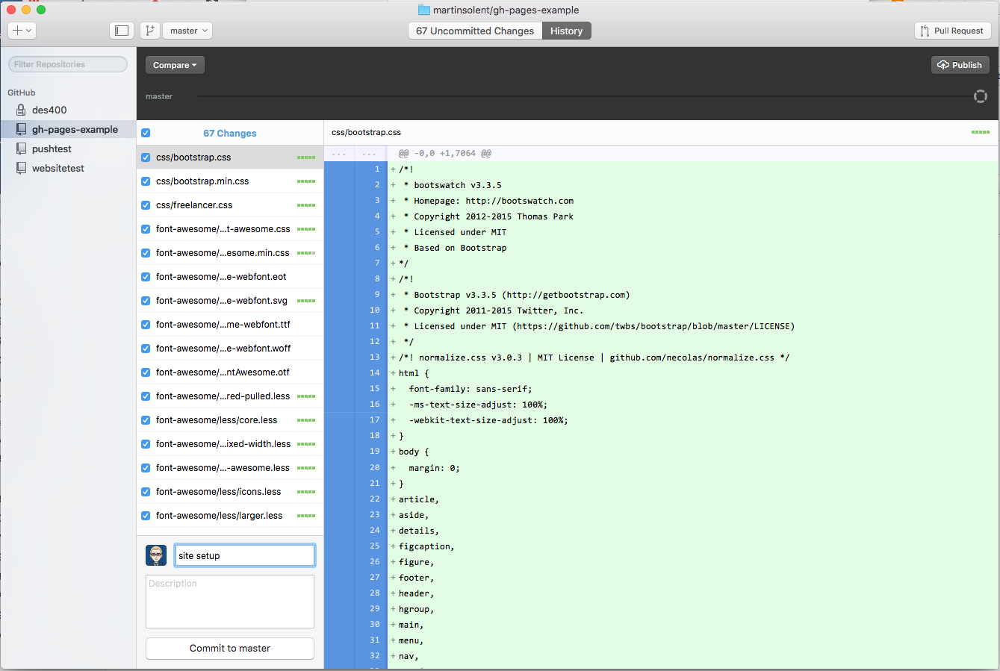

### Click on Publish
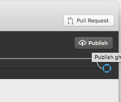

### Create Branch in GitHub Desktop call it gh-pages
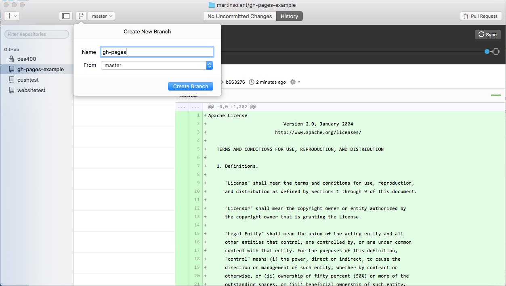

### Click on Publish or Sync

### On GitHub Repo (refresh browser) go to Setting & copy URL from green box
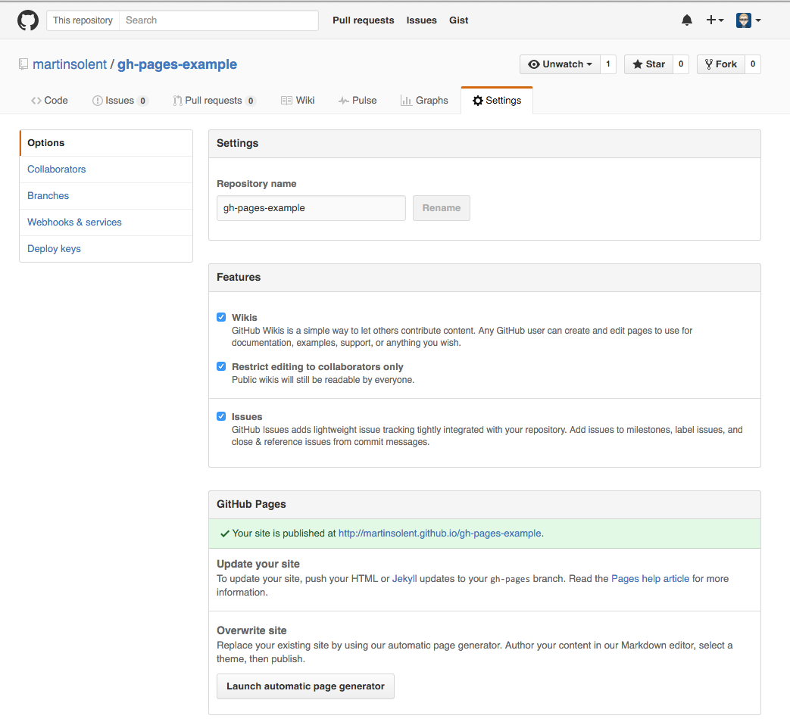

### Added URL to the top of the Repo description.
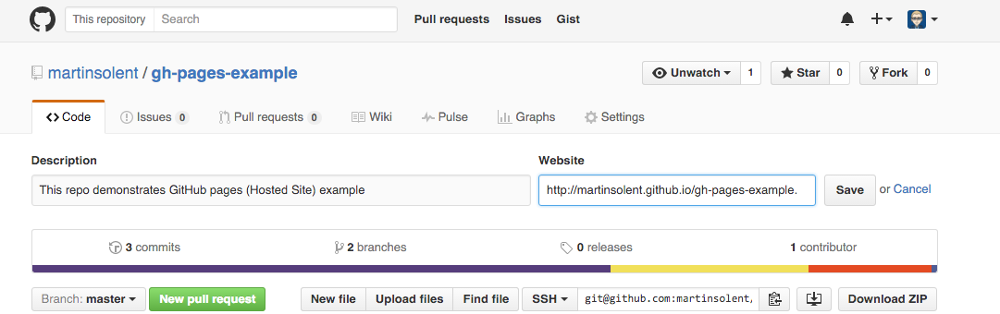

### URL now added.
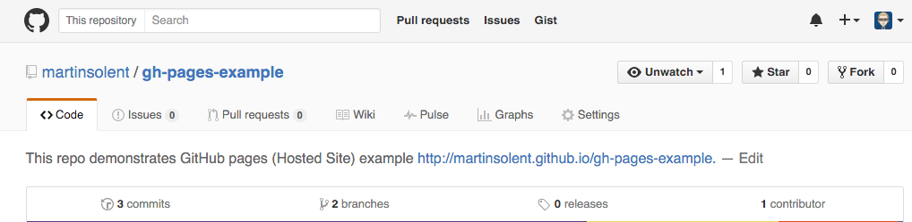

### Follow URL to check it works

